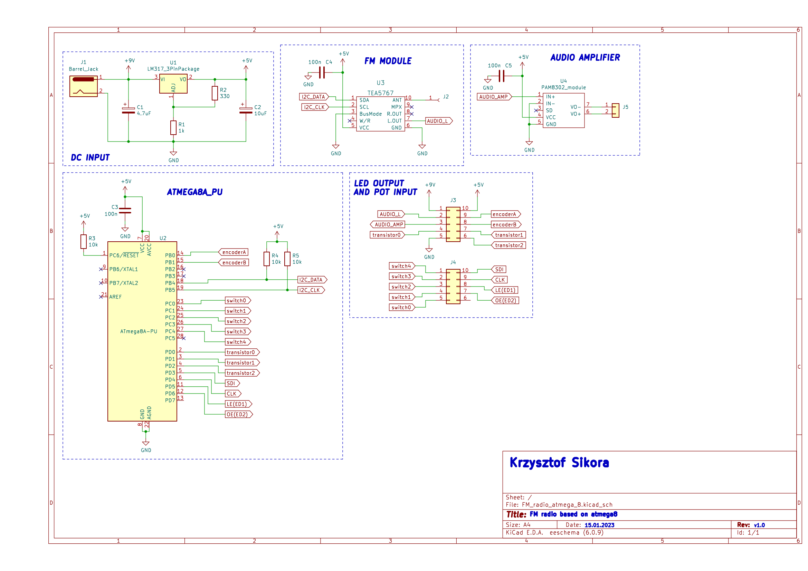
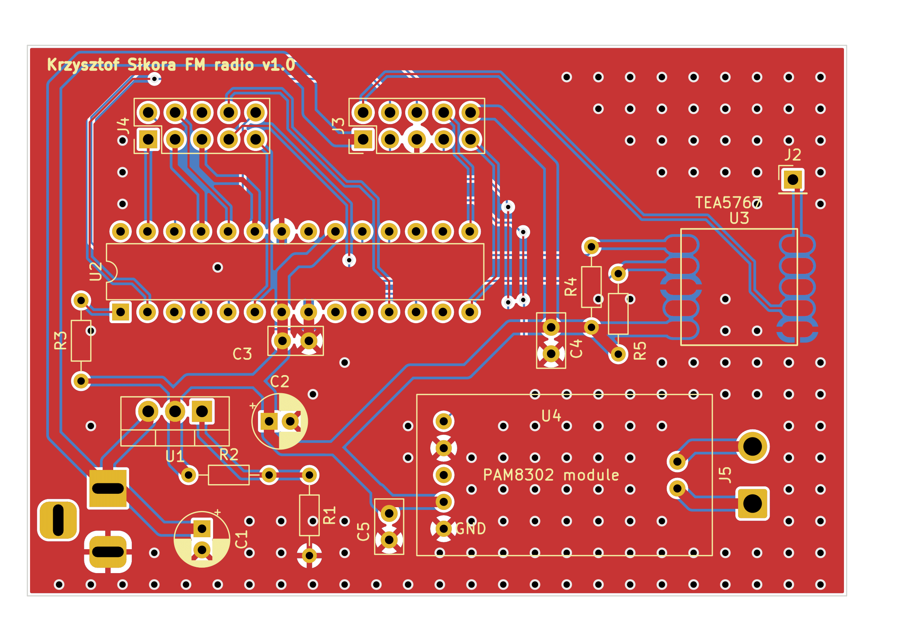
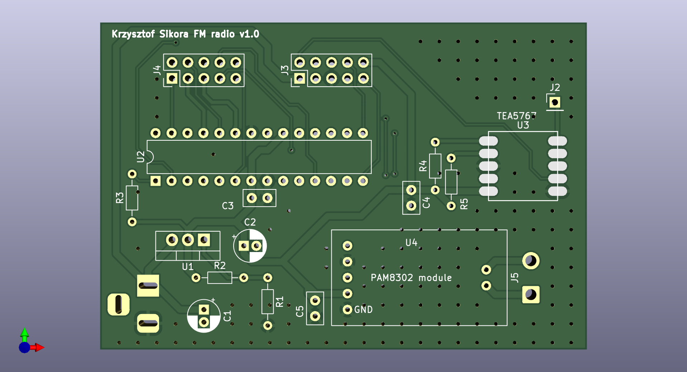

# Atmega8 FM radio
This project is a revision of one of my old designs, done a long long time ago when atmel atmega chips where still dirty cheap.

It contains two seperate boards: 
 - main_radio_board - the one with atmega8, tea5767 radio module, power amplifier for the speaker and input power connector
 - display_and_controls_board - this one is specificly designed to fit in an old unitra radio case, it has LEDs used as radio frequency indicators, rotary encoder for changing the frequency, potentiometer for volume and some additional buttons.

 If you want to use my main radio board in your design, all you have to do is connect power to it, as well as rotary encoder, potentiometer and power to specific output pins on the board. You don't have to connect all the LED output pins if you're not planning on using them or you can use them to drive an LCD etc.

## Schematic
The schematic and PCB were both designed using KiCAD 6.0

## PCB design
PCB:

3d view:

## Author
Krzysztof Sikora
Kraków, 01.2023
